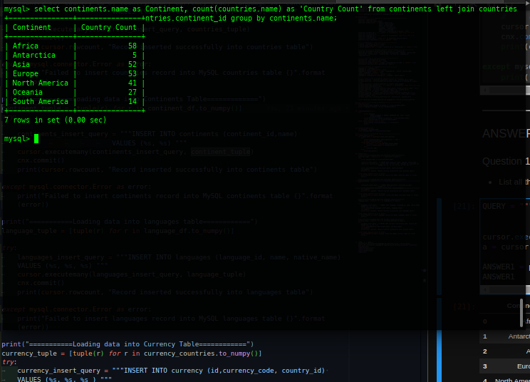
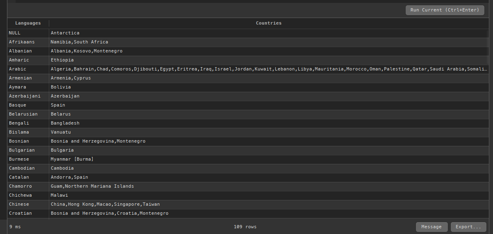
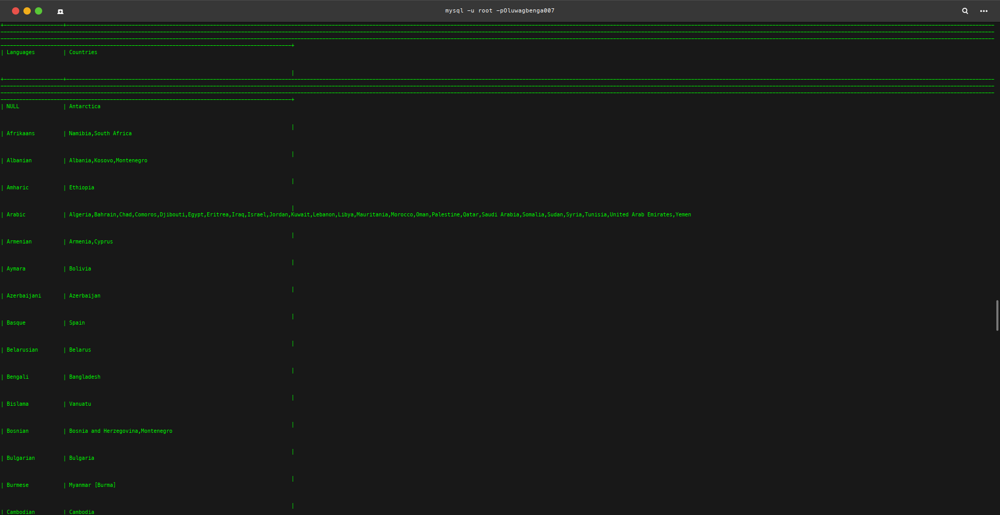
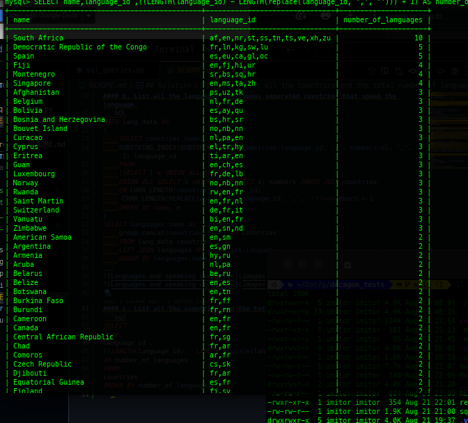

## Decagon_test
### Run
1. ```make setup``` 
2. ```make install```
3. To start the process ```make run```

## Solution
#### a. List all the continents and the total number of countries in each—for example, Africa 100, Europe 10, etc. The continent's name and country count should be in a different column.

```sql
select continents.name as Continent, 
count(countries.name) as 'Country Count' 
from continents 
left join countries 
on continents.continent_id = countries.continent_id 
group by continents.name;
```

#### b. List all the languages and commas separated countries that speak the language.
```SQL
WITH lang_data AS 
(
	SELECT countries.name,
	SUBSTRING_INDEX(SUBSTRING_INDEX(countries.language_id, ',', numbers.n), ',', -1) language_id
	FROM 
	(SELECT 1 n UNION ALL SELECT 2 
	UNION ALL SELECT 3 UNION ALL SELECT 4) numbers INNER JOIN countries 
	ON CHAR_LENGTH(countries.language_id)
	-CHAR_LENGTH(REPLACE(countries.language_id, ',', ''))>=numbers.n-1 
	ORDER BY name, n
)
SELECT languages.name as 'Languages', 
	group_concat(countries.name) as Countries 
	FROM lang_data countries 
	LEFT JOIN languages ON countries.language_id = languages.language_id 
	GROUP BY languages.name;
```



#### c. List all the countries and the total number of languages spoken.
```sql
SELECT 
name,
language_id ,
((LENGTH(language_id) - LENGTH(replace(language_id, ',', ''))) + 1) 
AS number_of_languages 
FROM 
countries 
ORDER BY number_of_languages DESC;
```
